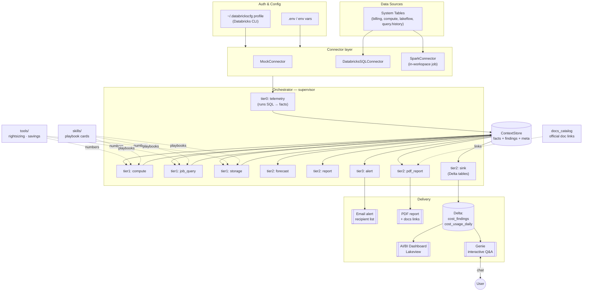

# High-Level Architecture



## Layers

| Layer | Responsibility | Swap point |
|-------|----------------|-----------|
| Auth/Config | `Settings`, `~/.databrickscfg` profile | `databricks_cfg.read_profile` |
| Connector | run SQL (mock / SQL warehouse / Spark) | `connectors/base.Connector` |
| Telemetry | System Tables → normalized facts | `sql/queries.py` |
| Analysis agents | detect waste, emit `Finding`s | `@register_agent` |
| Tools | deterministic $ math | `tools/` |
| Skills | capability playbooks | `skills/*.md` |
| Delivery | email · PDF · Delta · dashboard · Genie | `notifications/`, agents |

## Run modes
- **Local / CI** — `dbxopt run` (env or CLI profile auth; SQL warehouse connector).
- **In-workspace job (DAB)** — `databricks bundle run` → Spark connector, writes Delta, dashboard resource renders.
- **Interactive** — `dbxopt genie` chats over the output tables.
```
